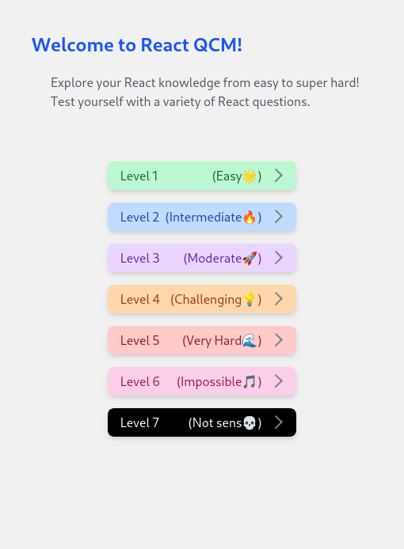
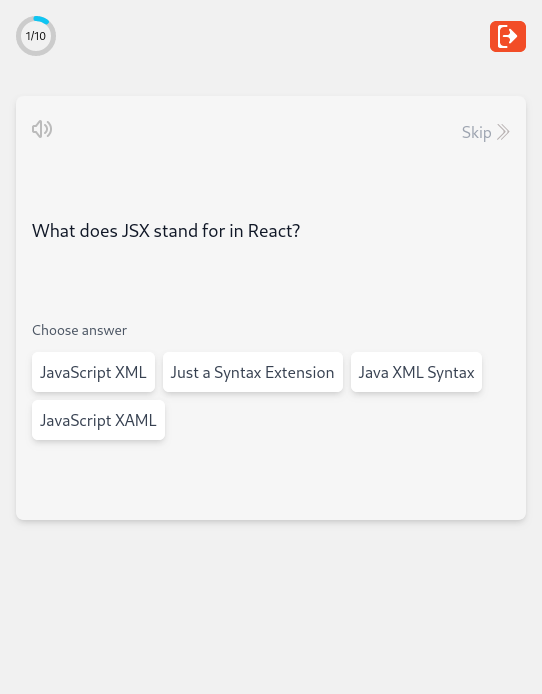
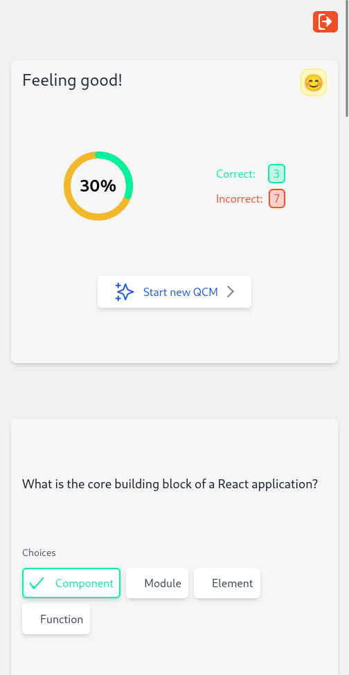
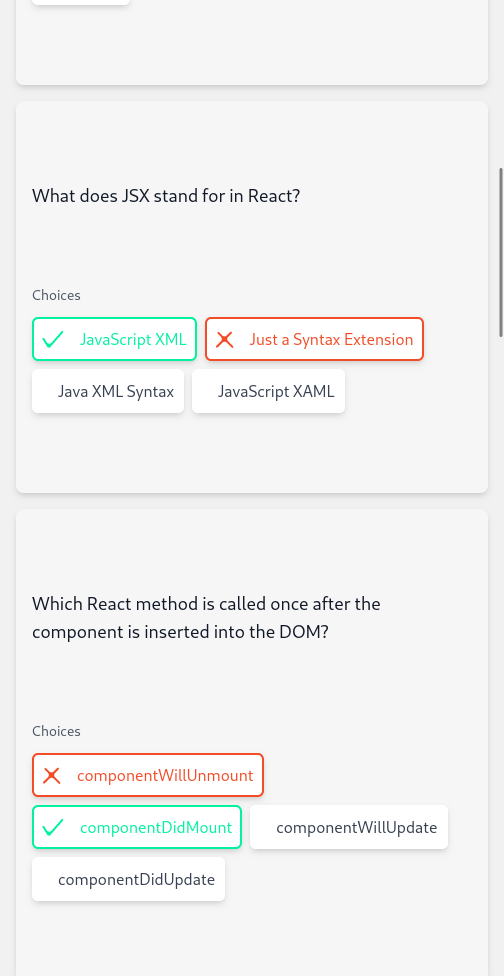

# React QCM App

Welcome to the React QCM (Multiple Choice Questions) App! This application is designed to provide users with a platform to select a level, attempt a set of questions, and receive results and correctness feedback. It's built with Vite, Zustand, Tailwind CSS, and React Router.

- Screenshot 1
  <br/>
  
  <br/>
- Screenshot 2
  <br>
  
  <br/>
- Screenshot 2
  <br/>
  
  <br/>
- Screenshot 3
  <br/>
  

## Figma Design

You can access the introductory Figma design for this project by [clicking here](https://www.figma.com/file/iSEQYtNPSZCu04HOGNeejB/QCM-app?type=design&mode=design&t=Yf7DRwhJmB6XV4YA-1).

## Features

- **Choose Your Level**: Select a difficulty level from the available options.

- **Interactive Questions**: Engage with multiple-choice questions by clicking on your chosen answers.

- **Results and Correctness**: Receive immediate feedback on your answers, including your overall score and the correctness of each question.

## Getting Started

To run this app locally, follow these steps:

1. Clone this repository to your local machine:

```
https://github.com/Z-Najdaoui/QCM.git
```

2. Navigate to the project directory:

```
cd QCM
```

3. Install dependencies:

```
npm install
```

4. Start the development server:

```
npm run dev
```

5. Open your browser and access the app at `http://localhost:port`.

## Technologies Used

- [Vite](https://vitejs.dev/): A fast build tool for modern web development.

- [Zustand](https://github.com/pmndrs/zustand): A minimalistic state management library for React.

- [Tailwind CSS](https://tailwindcss.com/): A utility-first CSS framework.

- [React Router](https://reactrouter.com/): Declarative routing for React.

Happy coding!
